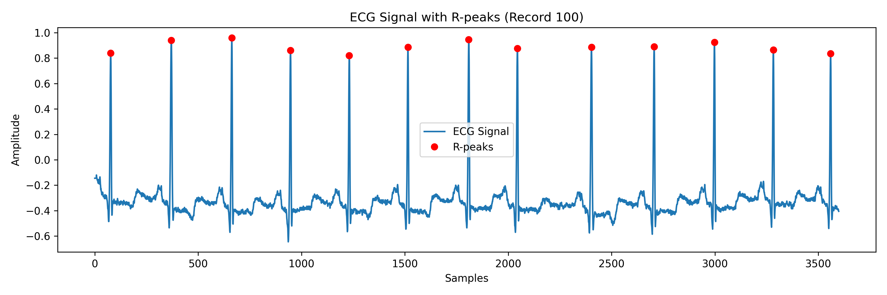

# ECG Arrhythmia Analysis 

This project analyzes real ECG signals from the MIT-BIH Arrhythmia Database
to detect arrhythmia using both rule-based analysis and machine learning.

The goal is to build an explainable end-to-end ECG analysis pipeline,
from raw ECG signals to classification results.

---

## Example ECG Visualization

## Dataset
- Source: MIT-BIH Arrhythmia Database
- Records used:
  - Normal: 100, 101, 102, 103
  - Arrhythmia: 200, 201, 202, 203
- Signal duration: first 30 seconds
- Sampling frequency: 360 Hz

---

## Feature Extraction
Heart Rate Variability (HRV) features extracted from R–R intervals:

- Mean RR interval
- Median RR interval
- RR standard deviation
- Minimum RR
- Maximum RR
- Mean BPM
- BPM standard deviation
- RMSSD
- SDNN
- pNN50

Extracted features are saved to:

data/ecg_features.csv

---

## Methods

### Rule-Based Analysis
- R-peaks detected using scipy.signal.find_peaks
- RR intervals and BPM calculated
- Rhythm variability analyzed using HRV metrics

### Machine Learning
- Model: Logistic Regression
- Input: HRV features
- Train/Test split: 75% / 25%
- Library: scikit-learn

Note:
Due to the small dataset size, ML results may appear overly optimistic.
This project is for educational and demonstration purposes.

---

## How to Run

Install dependencies:
pip install -r requirements.txt

Generate features:
python src/plot_first_ecg.py

Train ML classifier:
python src/ml_classifier.py

---

## Output
- HRV feature dataset (CSV)
- Classification accuracy and confusion matrix printed in terminal

---

## Project Structure

ecg-arrhythmia-analysis/
├── data/
│   └── ecg_features.csv
├── src/
│   ├── plot_first_ecg.py
│   └── ml_classifier.py
├── requirements.txt
└── README.md

---

## Future Work
- Increase dataset size
- Add frequency-domain HRV features
- Compare multiple ML models
- Feature importance visualization
- Advanced ECG signal analysis

---

## Author
Berre

